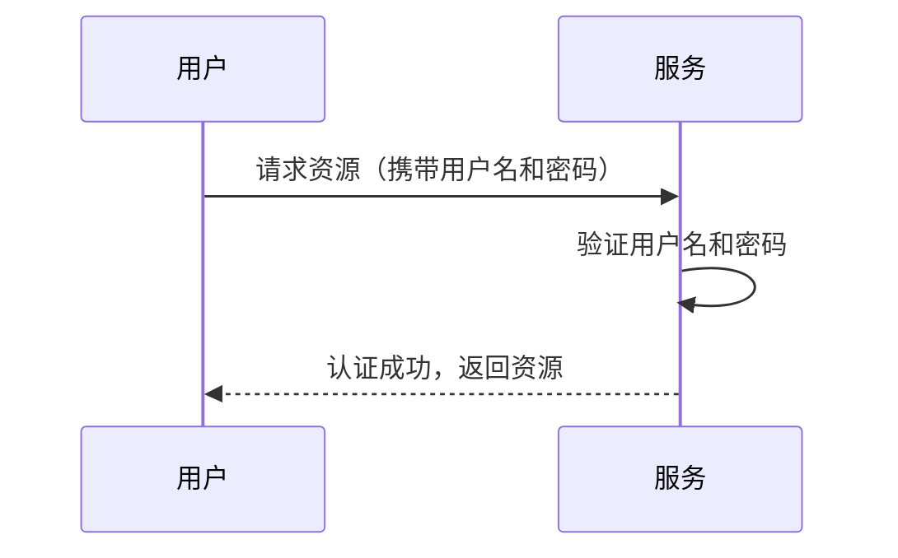
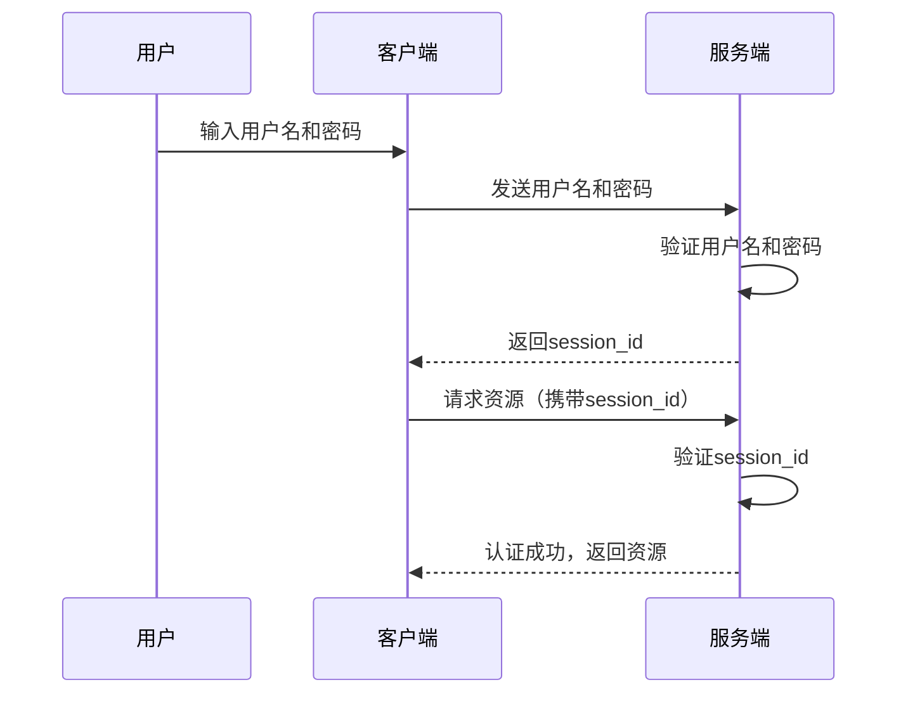
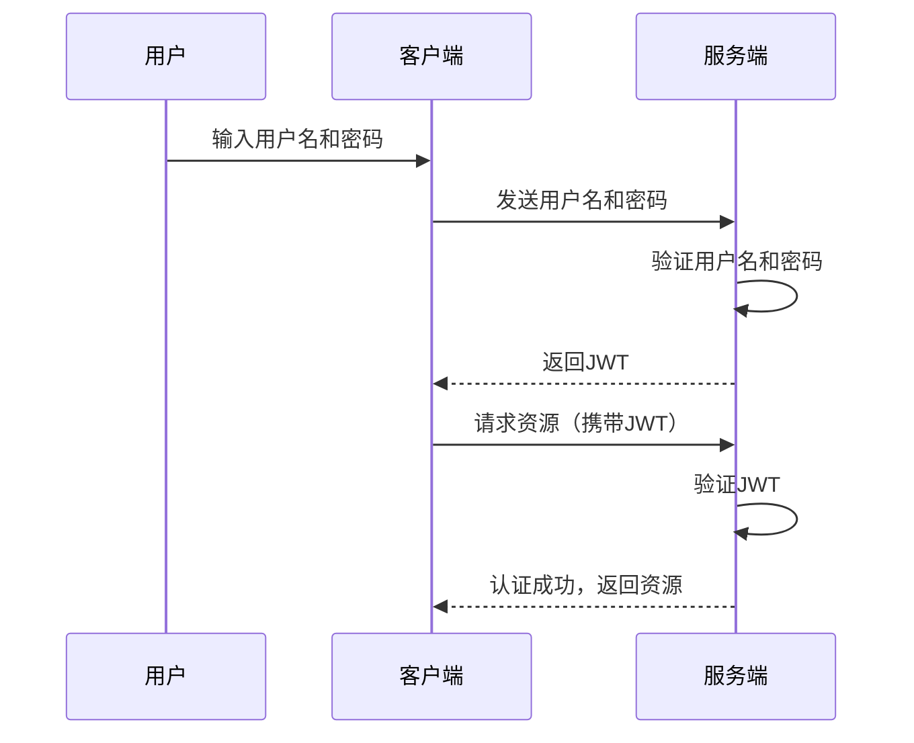
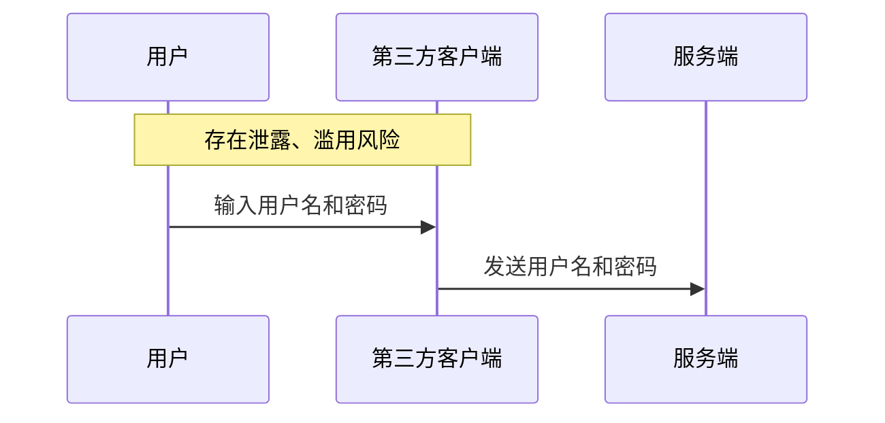
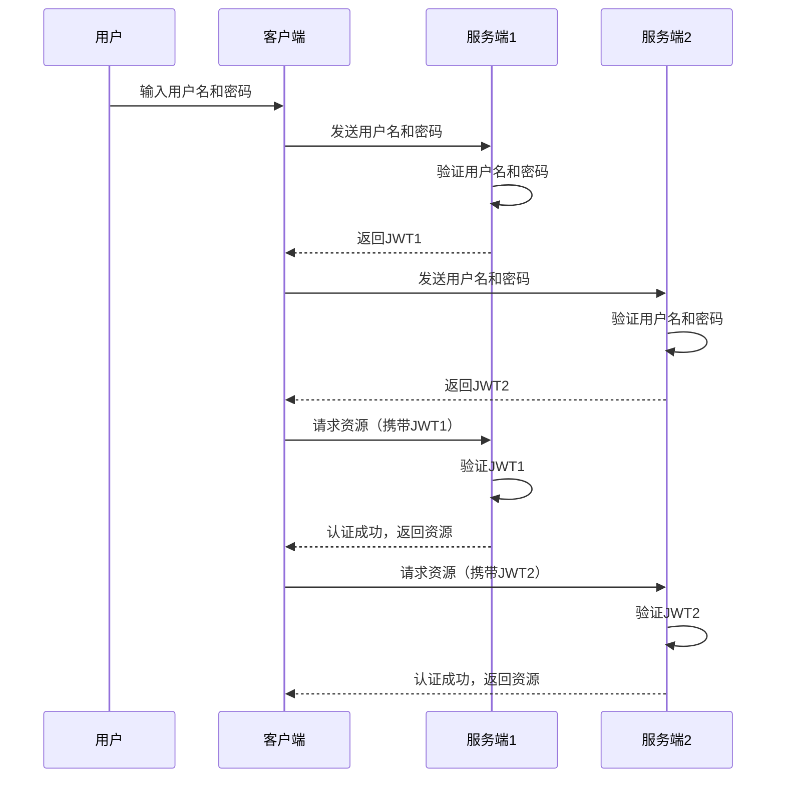
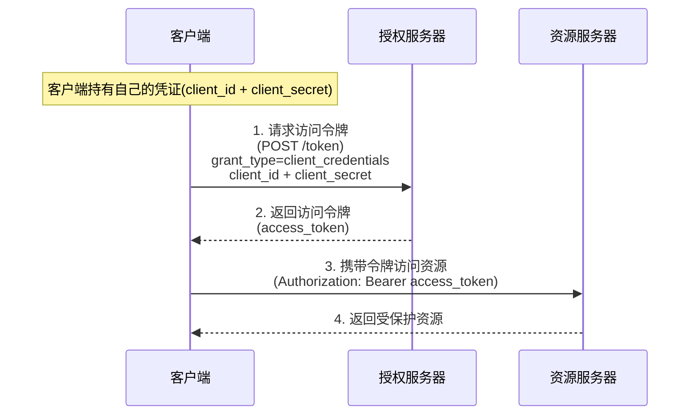
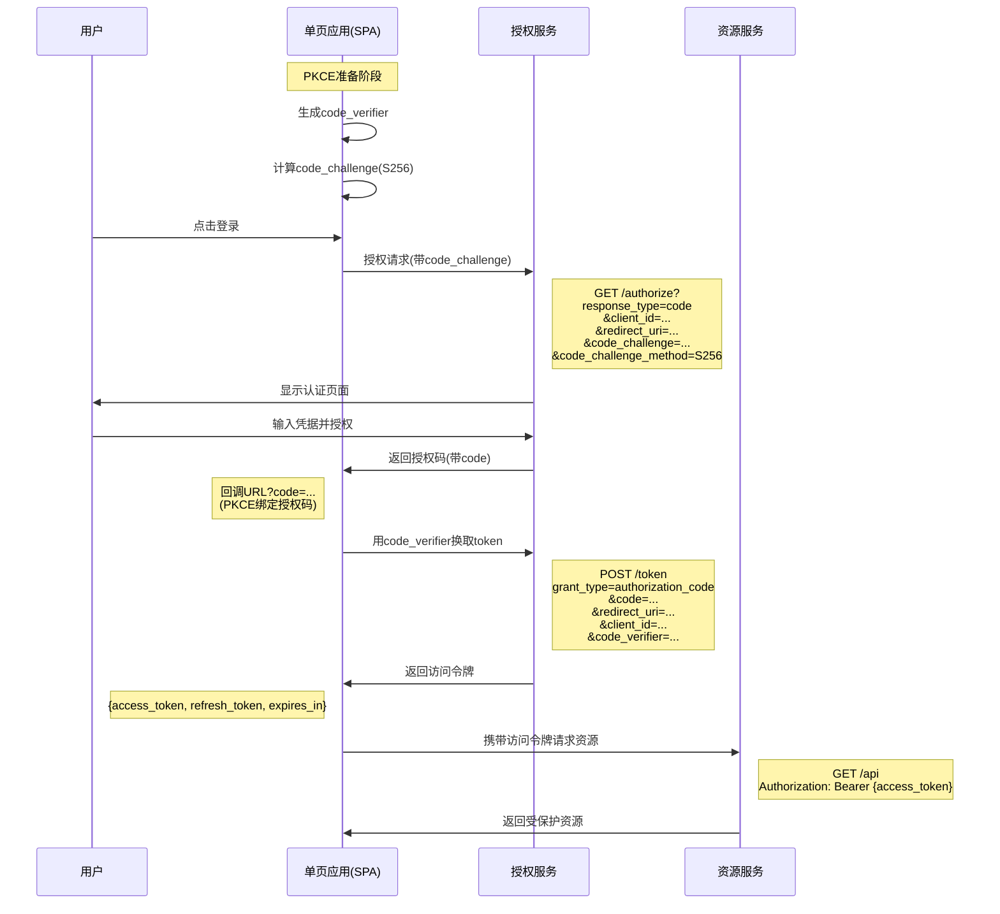

# 互联网认证授权机制

## 1.认证授权机制

认证授权机制无非是解决两个问题：

- 认证：确定申请授权者的身份，通常有几种方式：
    1. 比对用户名和密码。
    2. 通过id确认身份
    3. 读取令牌中的身份信息。
- 授权：授权时确认申请者的权限，通过令牌等方式授予访问资源的权限

## 2.最简单的认证授权场景与机制

我们来考虑最简单的一种认证授权场景，用户每次使用用户名和密码向服务器请求资源

这种机制有两个缺点：

1. 每次请求都需要用户输入用户名和密码，且每个请求都携带用户名和密码，有安全风险
2. 用户名和密码泄露时无法防御

## 3.使用`session_id`的认证授权

为了解决每次访问都要传递用户名和密码的问题，我们可以使用`session_id`方案。该方案中客户端只需要像服务传递一次用户名和密码，服务端会返回一个`session_id`，客户端下次请求时只需要携带`session_id`即可。

这种方案的优点是：

1. 客户端只需要传递一次用户名和密码
2. `session_id`泄露后可以直接修改id-用户映射表

这种方案的缺点是：

1. 服务端需要维护`session_id`到用户的映射

## 4. 使用`JWT`的认证授权

### 4.1 `JWT`简介

`JWT`是`JSON Web Token`的缩写，是最常用的一种令牌。  
由三部分组成`header.payload.signature`，其中`header`是说明令牌类型和加密算法的元数据，`payload`是携带的用户数据，`signature`是加密签名。
有两类可以使用的加密签名算法：

1. 消息验证码算法，如`HMAC`：，只有拥有密钥一方（授权服务）才可以生成正确的签名，也只有拥有密钥（授权服务）一方才可以验证签名。
2. 非对称加密算法，如`RSA`：，只有拥有私钥的一方（授权服务）才可以生成正确的签名，只有拥有公钥的一方（授权服务和资源服务）才可以验证签名。

### 4.2 使用`JWT`的认证授权机制

服务端可以利用密钥生成`JWT`，只要在请求服务时携带`JWT`即可。而不需要维持`session_id`到用户的映射表。

这种方案的优点是：

1. 服务端不需要维护`session_id`到用户的映射
2. `JWT`可以防止篡改，可以设置有效期，可以设置白名单，可以设置黑名单

## 5.oAuth2认证授权

### 5.1 传统认证授权机制的缺陷

上述授权机制存在一些问题：

#### 5.1.1 第三方客户端

当客户端并非服务提供方官方提供时，即为第三方客户端。
当用户使用第三方客户端访问服务时，可能并不希望将服务的用户名和密码告诉第三方客户端。

#### 5.1.2 分散服务授权

如果用户希望获取多个服务的授权，则需要在分别在多个服务中注册、认证、授权，用户要分别维护多个身份令牌或id。

#### 5.2 oAuth2认证授权机制

使用oAuth2可以解决第三方客户端获取资源服务和分散服务授权的问题。此时通过一个用户与资源服务都信赖的授权服务实现所有认证授权。oAuth2利用重定向和令牌机制，无令牌访问资源服务时会重定向至授权服务页面，用户登录后授权服务会将授权码（后续用以换取令牌）或令牌以重定向方式传回客户端，客户端使用令牌来完成后续的资源服务访问。

#### 5.3 oAuth2的几种流程

| 流程                | 适用场景                | 是否需要用户参与 | 是否需要 `client_secret` | 安全性 |
|---------------------|------------------------|----------------|------------------------|--------|
| 授权码模式          | Web 后端应用           | 是             | 是                     | ⭐⭐⭐⭐ |
| 简化模式（不推荐）  | SPA                   | 是             | 否                     | ⭐     |
| 密码模式            | 受信任的内部应用       | 是             | 是                     | ⭐⭐   |
| 客户端凭证模式      | 服务间调用             | 否             | 是                     | ⭐⭐⭐ |
| PKCE 扩展           | 移动端/SPA             | 是             | 否                     | ⭐⭐⭐⭐ |

#### 5.4 授权码模式

授权码模式是最安全的一种oAuth2流程，它使用授权码来交换令牌。这种模式需要有客户端后端。

>在授权模式中，会假设客户端能比浏览器更安全的保存与使用令牌，因此浏览器仅仅知道一次性授权码，而不持有令牌。

##### 5.5 客户端凭证模式

客户端凭证模式适用于机器对机器场景（如后台服务间通信），同时假设客户端可以安全的持有令牌。

##### 5.6 PKCE扩展模式

如果客户端没有后端，可以采用简化模式（类似于客户端凭证模式，但并不足够安全），或采用PKCE拓展模式（推荐）。以下是PKCE拓展模式的时序图：

