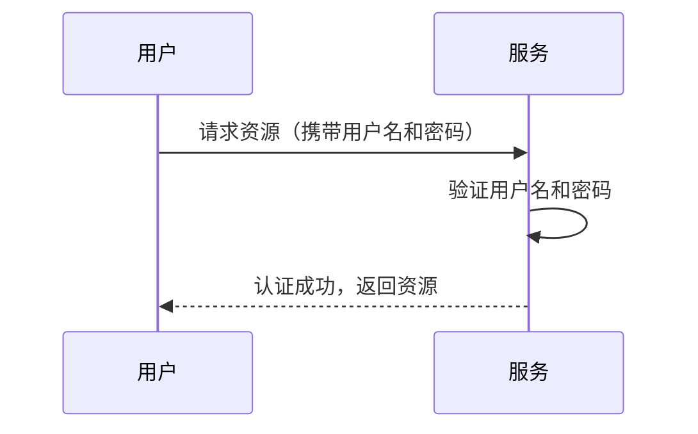
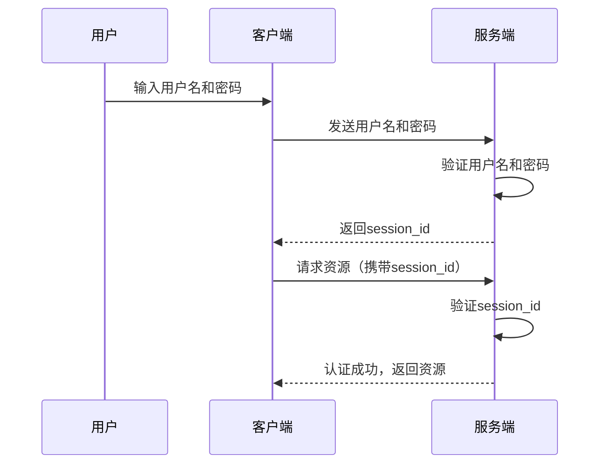
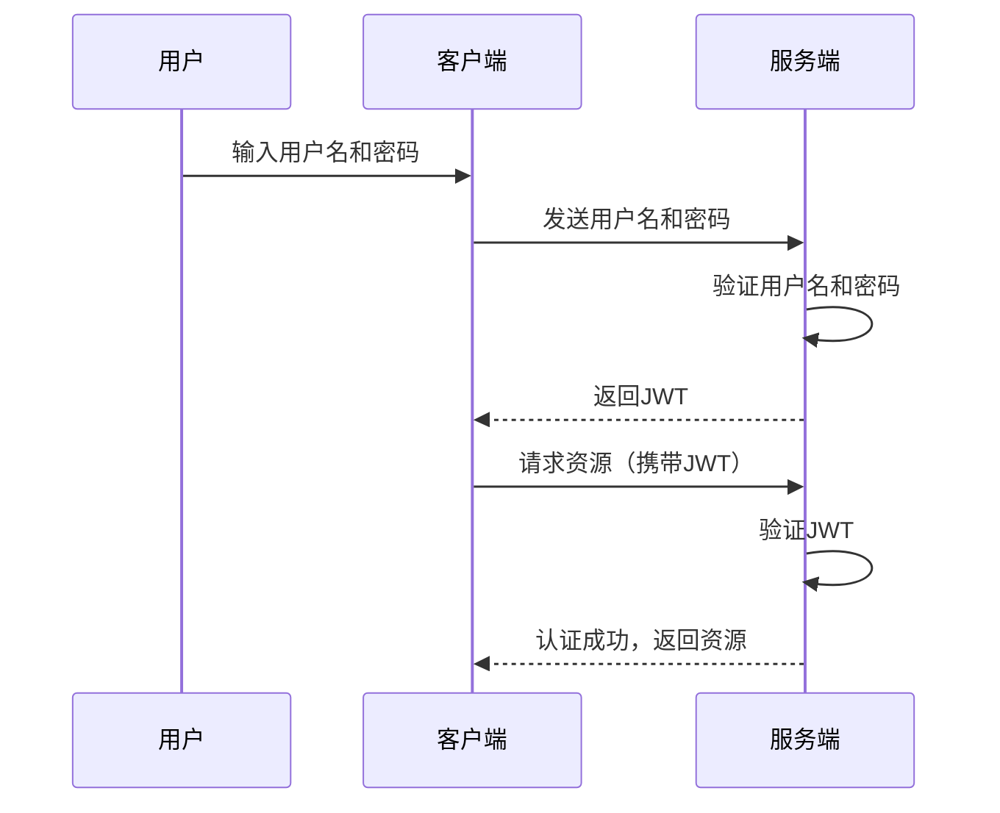
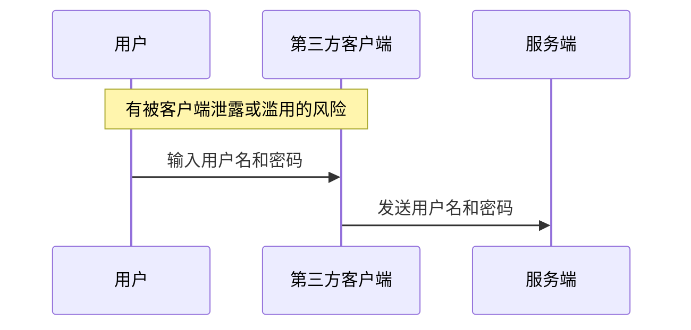
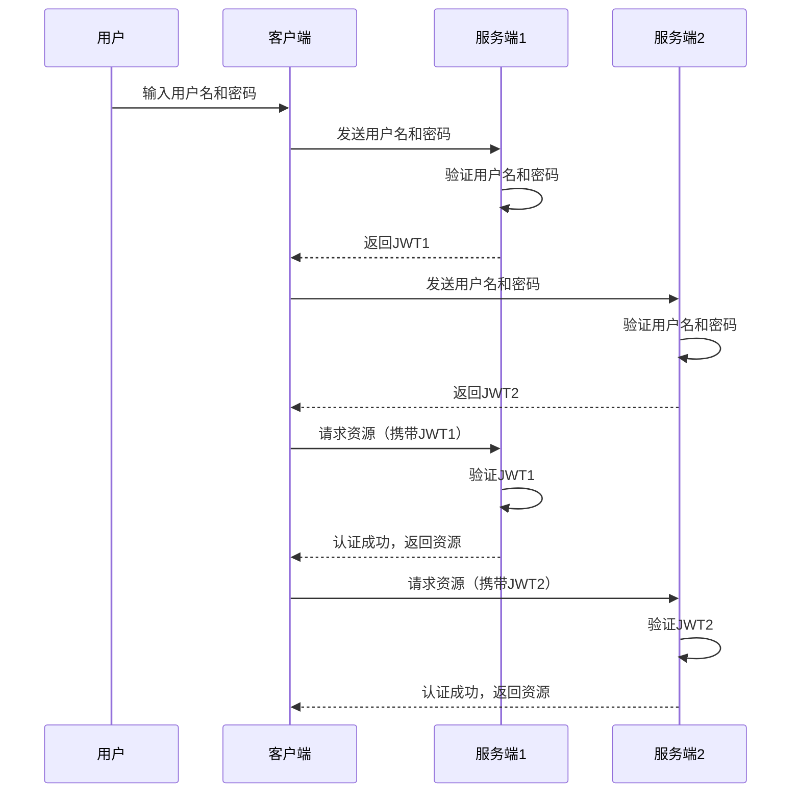
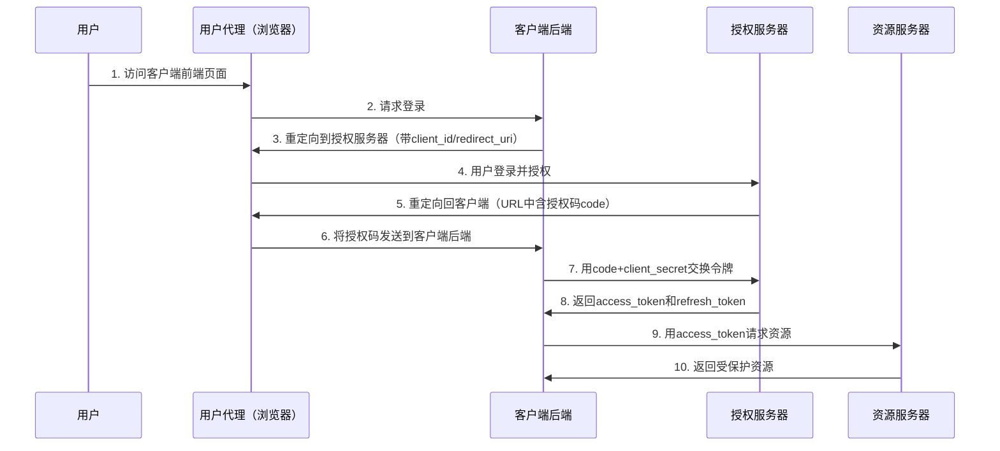
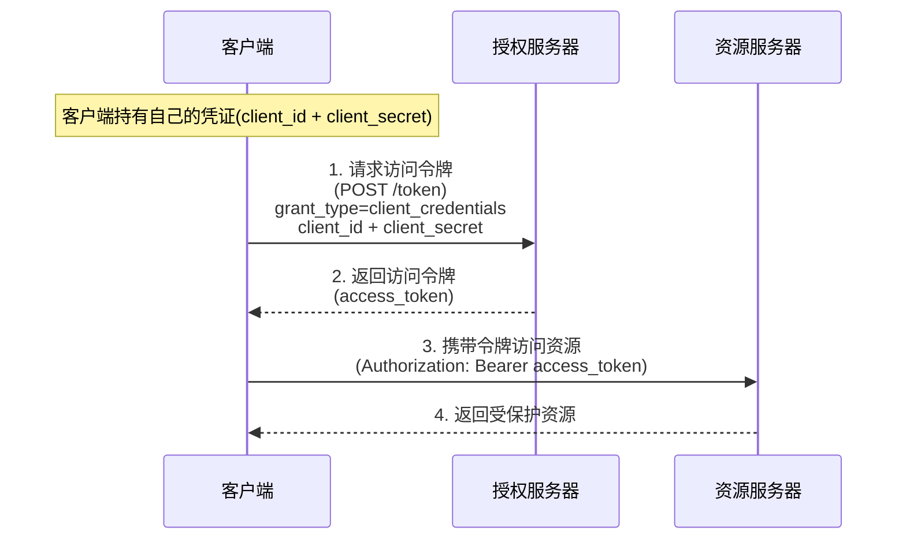
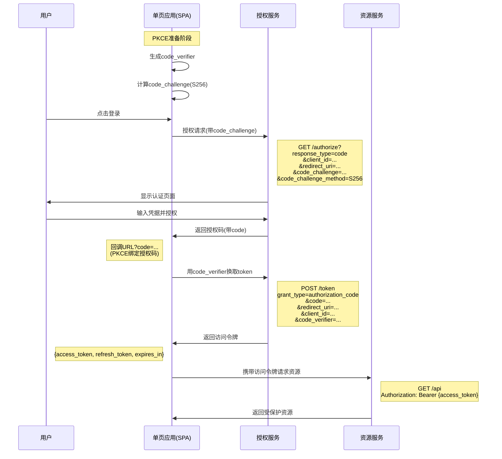
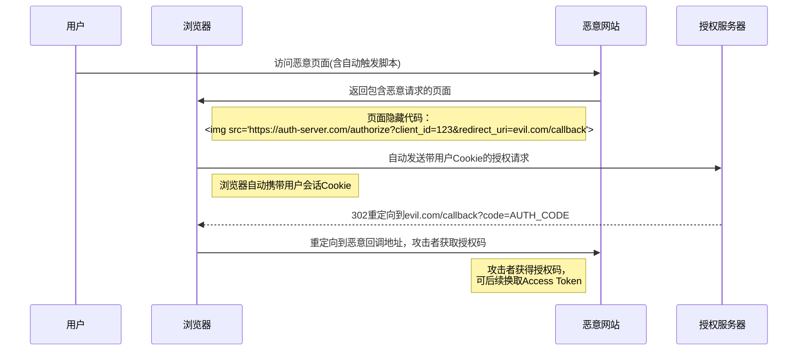
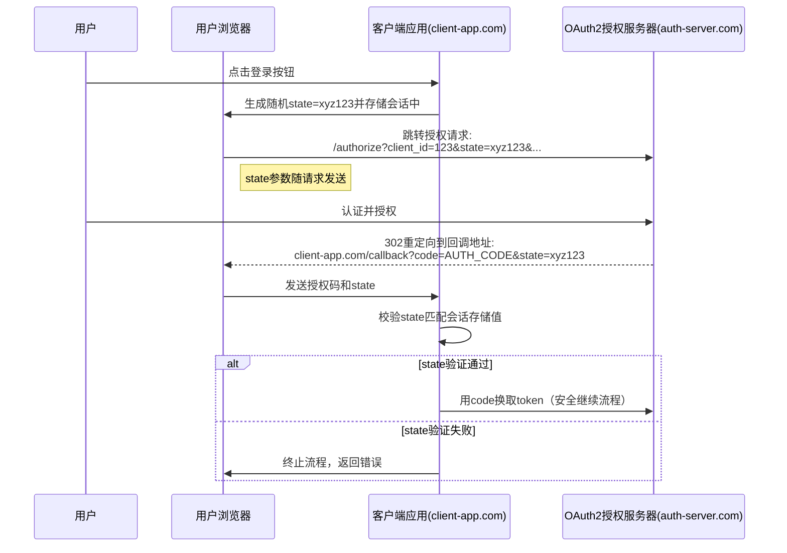

# 互联网认证授权机制

## 1.认证授权机制

认证授权机制无非是解决两个问题：

- 认证：确定申请授权者的身份，通常有几种方式：
    1. 比对用户名和密码。
    2. 通过标识符（如`session_id`和`Token`）确认身份
- 授权：授权时确认已认证用户的权限，通过发放令牌等方式授予访问资源的权限

## 2.最简单的认证授权场景与机制

我们来考虑最简单的一种认证授权场景，用户每次使用用户名和密码向服务器请求资源



这种机制有两个缺点：

1. 客户端每次请求都需要携带用户的完整凭证（用户名和密码），增加了凭证在传输过程中被截获的风险
2. 用户名和密码泄露时无法防御

## 3.使用`session_id`的认证授权

为了解决每次访问都要传递用户名和密码的问题，我们可以使用`session_id`方案。该方案中客户端只需要像服务传递一次用户名和密码，服务端会返回一个`session_id`，客户端下次请求时只需要携带`session_id`即可。



这种方案的优点是：

1. 客户端只需要传递一次用户名和密码
2. `session_id`泄露后可以直接从映射表中删除该`session_id`记录

这种方案的缺点是：

1. 服务端需要维护`session_id`到用户的映射

## 4. 使用`JWT`的认证授权

### 4.1 `JWT`简介

`JWT`是`JSON Web Token`的缩写，是最常用的一种令牌。  
由三部分组成`header.payload.signature`，其中`header`是说明令牌类型和加密算法的元数据，`payload`是携带的用户数据，`signature`是加密签名。
有两类可以使用的加密签名算法：

1. 消息验证码算法，如`HMAC`，只有拥有密钥一方（授权服务）才可以生成正确的签名，也只有拥有密钥（授权服务）一方才可以验证签名。
2. 非对称加密算法，如`RSA`，只有拥有私钥的一方（授权服务）才可以生成正确的签名，任何拥有公钥的一方（授权服务和资源服务）可以验证签名。

### 4.2 使用`JWT`的认证授权机制

服务端可以利用密钥生成`JWT`，只要在请求服务时携带`JWT`即可。而不需要维持`session_id`到用户的映射表。



这种方案的优点是：

1. 服务端不需要维护`session_id`到用户的映射
2. `JWT`可以防止篡改，可以通过设置有效期降低泄露后的风险

而缺点有：

1. 一旦签发，在有效期内难以主动吊销（除非引入额外的状态管理，如黑名单机制）

## 5.oAuth2认证授权

### 5.1 传统认证授权机制的缺陷

上述授权机制存在一些问题：

#### 5.1.1 第三方客户端

当客户端并非服务提供方官方提供时，即为第三方客户端。
当用户使用第三方客户端访问服务时，可能并不希望将服务的用户名和密码告诉第三方客户端。



#### 5.1.2 分散服务授权

如果用户希望获取多个服务的授权，则需要在分别在多个服务中注册、认证、授权，用户要分别维护多个身份令牌或id。



### 5.2 oAuth2认证授权机制

使用oAuth2可以解决第三方客户端获取资源服务和分散服务授权的问题。此时通过一个用户与资源服务都信赖的授权服务实现所有认证授权。oAuth2利用重定向和令牌机制，无令牌访问资源服务时会重定向至授权服务页面，用户登录后授权服务会将授权码（后续用以换取令牌）或令牌以重定向方式传回客户端，客户端使用令牌来完成后续的资源服务访问。

### 5.3 oAuth2的几种流程

| 流程                | 适用场景                | 是否需要用户参与 | 是否需要 `client_secret` | 安全性 |
|---------------------|------------------------|----------------|------------------------|--------|
| 授权码模式          | Web 后端应用           | 是             | 是                     | ⭐⭐⭐⭐ |
| 简化模式（不推荐）  | SPA                   | 是             | 否                     | ⭐     |
| 密码模式            | 受信任的内部应用       | 是             | 是                     | ⭐⭐   |
| 客户端凭证模式      | 服务间调用             | 否             | 是                     | ⭐⭐⭐ |
| PKCE 扩展           | 移动端/SPA             | 是             | 否                     | ⭐⭐⭐⭐ |

### 5.4 授权码模式

授权码模式是最安全的一种oAuth2流程，它使用授权码来交换令牌。这种模式需要有客户端后端。



>在授权模式中，会假设客户端后端能比用户代理（如浏览器）更安全的保存与使用令牌，因此浏览器仅仅知道一次性授权码，而不持有令牌。

### 5.5 客户端凭证模式

客户端凭证模式适用于机器对机器场景（如后台服务间通信），同时假设客户端可以安全的持有令牌。



### 5.6 PKCE扩展模式

如果客户端没有后端，可以采用简化模式（类似于客户端凭证模式，但并不足够安全），或采用PKCE拓展模式（推荐）。以下是PKCE拓展模式的时序图：



1.PKCE准备阶段（客户端本地）

```javascript
// 生成随机的code_verifier（为43-128字符的随机字符串，包含字母、数字、-、.、_、~）
const code_verifier = generateRandomString(); 
// 示例：Base64URL(SHA256(code_verifier))
const code_challenge = base64url(sha256(code_verifier)); 
```

2.发起授权请求（浏览器跳转）

```http
GET /authorize?response_type=code&client_id=spa_client&code_challenge=abc123...&code_challenge_method=S256&state=xyz123&redirect_uri=https://app.com/callback HTTP/1.1
Host: auth-server.com
```

>`redirect_uri`是登陆后回调的URL，用以传递授权码
>携带`code_challenge`防止授权码截获攻击
>携带`state`防止跨站请求伪造攻击（CSRF）
>详见：[使用state防止CSRF攻击](#使用state防止csrf攻击)

3.用户认证授权（浏览器交互）
用户在授权服务页面完成登录和授权

3.1 登录页面

```http
HTTP/1.1 200 OK
Content-Type: text/html
Location: https://auth-server.com/login

<!DOCTYPE html>
<html>
<head>
  <title>Login</title>
</head>
<body>
  <form action="/login" method="POST">
    <input type="text" name="username" placeholder="Username">
    <input type="password" name="password" placeholder="Password">
    <input type="hidden" name="client_id" value="spa_client">
    <input type="hidden" name="redirect_uri" value="https://app.com/callback">
    <input type="hidden" name="code_challenge" value="abc123...">
    <button type="submit">Login</button>
  </form>
</body>
</html>

```

3.2 用户提交登录表单

```http
POST /login HTTP/1.1
Host: auth-server.com
Content-Type: application/x-www-form-urlencoded
Origin: https://auth-server.com

username=user123
&password=securePassword456
&client_id=spa_client
&redirect_uri=https%3A%2F%2Fapp.com%2Fcallback
&code_challenge=abc123...
```

3.3 用户登录成功

```http
HTTP/1.1 200 OK
Content-Type: text/html
<!DOCTYPE html>
<html>
<body>
  <h1>Authorize Access?</h1>
  <form action="/consent" method="POST">
    <input type="hidden" name="session_id" value="AUTH_SESSION_XYZ">
    <button type="submit">Allow</button>
  </form>
</body>
</html>
```

3.4 用户同意授权

```http
POST /consent HTTP/1.1
Host: auth-server.com
Content-Type: application/x-www-form-urlencoded
Cookie: session_id=AUTH_SESSION_XYZ

session_id=AUTH_SESSION_XYZ
&action=allow
```

4.接收授权码（前端路由回调）
授权服务重定向回原页面，携带授权码和state参数

```http
HTTP/1.1 302 Found
Location: https://app.com/callback?
  code=AUTH_CODE_123
  &state=xyz123
Set-Cookie: auth_session=...; Secure; HttpOnly; SameSite=Lax
```

浏览器会自动向redirect_uri发起GET请求

```http
GET /callback?code=AUTH_CODE_123&state=xyz123 HTTP/1.1
Host: app.com
Cookie: session=...
```

5.用code_verifier换取令牌

```http
POST /token HTTP/1.1
Host: auth-server.com
Content-Type: application/x-www-form-urlencoded

grant_type=authorization_code
&code=AUTH_CODE_123
&redirect_uri=https://app.com/callback
&client_id=spa_client
&code_verifier=ORIGINAL_VERIFIER_456
```

6.获取令牌响应

```json
HTTP/1.1 200 OK
{
  "access_token": "eyJ...",
  "token_type": "Bearer",
  "expires_in": 3600,
  "refresh_token": "def...",
  "scope": "openid profile"
}
```

7.访问受保护资源

```http
GET /api/user HTTP/1.1
Host: resource-server.com
Authorization: Bearer eyJ...
```

8.资源服务器响应

```json
HTTP/1.1 200 OK
{
  "user_id": "123",
  "name": "John Doe"
}
```

## 6.附录

### 使用state防止CSRF攻击

#### CSRF攻击

CSRF(跨站请求伪造)是一种常见的Web安全威胁，而OAuth 2.0中的state参数是防止这类攻击的重要机制。

CSRF攻击示意图 (GET方式授权码请求场景)



#### 防止CSRF攻击

`state`参数是一个随机生成的字符串，在OAuth流程中用于维护请求和回调之间的状态。它主要有两个安全目的：

1. **防止CSRF攻击**：确保授权响应与初始授权请求来自同一来源
2. **维护应用状态**：在重定向前后保持应用状态信息

#### 工作原理

1. **请求阶段**：
   - 客户端生成一个随机值(如UUID)作为`state`参数
   - 将`state`与授权请求一起发送到授权服务器
   - 客户端应在本地(如session或cookie)存储此`state`值

2. **回调阶段**：
   - 授权服务器在重定向URI中返回相同的`state`值
   - 客户端验证返回的`state`是否与最初发送的值匹配
   - 如果不匹配，则拒绝请求，可能是CSRF攻击


