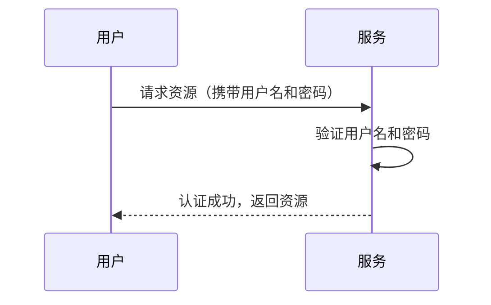
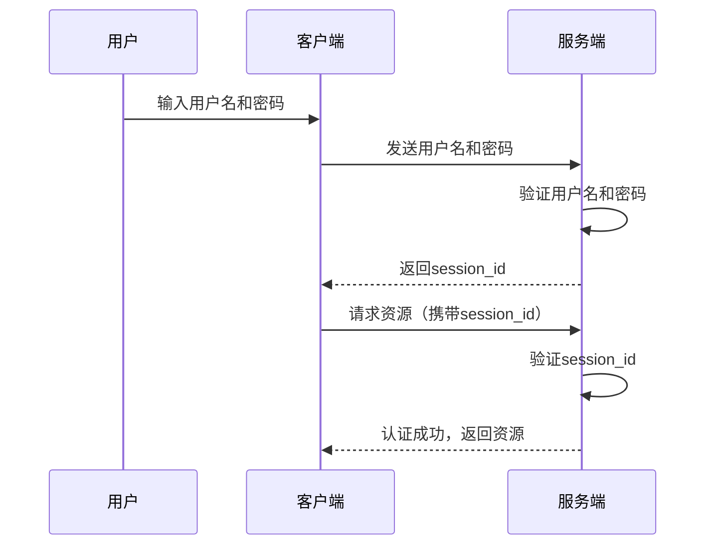
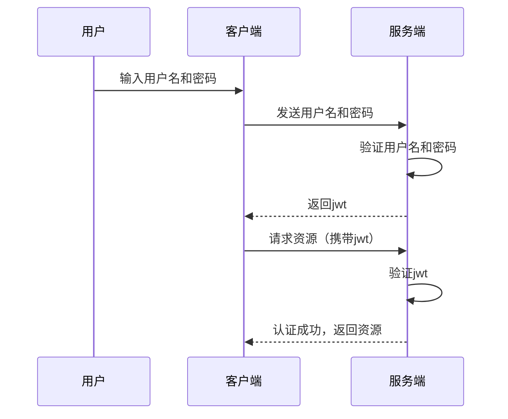
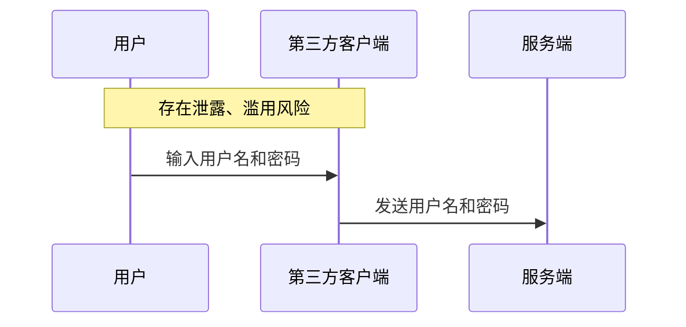
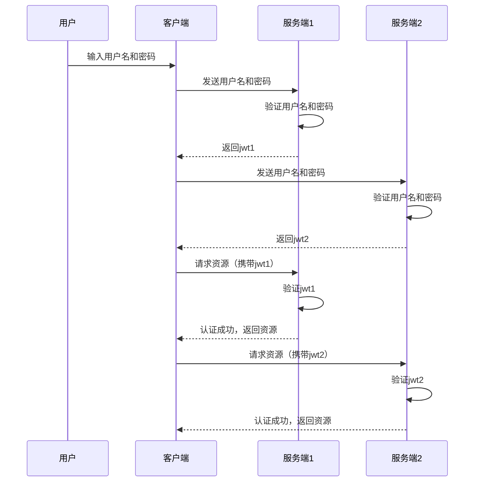
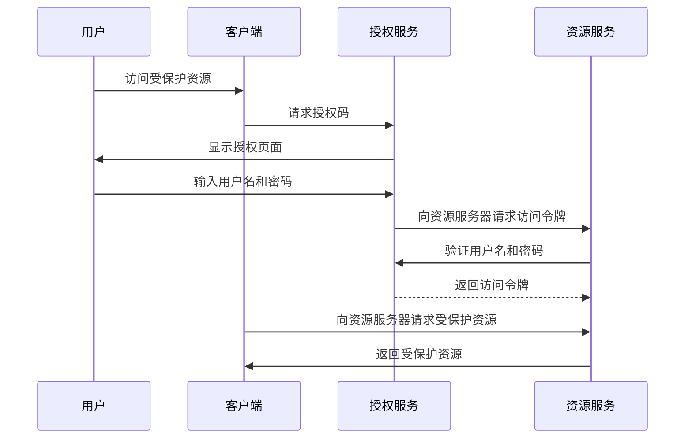

# 1.互联网认证授权机制
互联网认证授权机制无非是解决两个问题：
- 认证：确定申请授权者的身份，通常有几种方式：
    1. 比对用户名和密码。
    2. 通过id确认身份
    3. 读取令牌中的身份信息。
- 授权：授权时确认申请者的权限，通过令牌等方式授予访问资源的权限

# 2.最简单的认证授权场景与机制
我们来考虑最简单的一种认证授权场景，用户每次使用用户名和密码向服务器请求资源

这种机制有两个缺点：
1. 每次请求都需要用户输入用户名和密码，且每个请求都携带用户名和密码，有安全风险
2. 用户名和密码泄露时无法防御

# 3.使用`session_id`的认证授权
为了解决每次访问都要传递用户名和密码的问题，我们可以使用`session_id`方案。该方案中客户端只需要像服务传递一次用户名和密码，服务端会返回一个`session_id`，客户端下次请求时只需要携带`session_id`即可。

这种方案的优点是：
1. 客户端只需要传递一次用户名和密码
2. `session_id`泄露后可以直接修改id-用户映射表
这种方案的缺点是：
1. 服务端需要维护`session_id`到用户的映射

# 4.使用`jwt`的认证授权
为了解决服务端维护`session_id`的映射问题，我们可以使用`jwt`方案。该方案中客户端只需要像服务传递一次用户名和密码，服务端会返回一个`jwt`，客户端下次请求时只需要携带`jwt`即可。

这种方案的优点是：
1. 服务端不需要维护`session_id`到用户的映射
2. `jwt`可以防止篡改，可以设置有效期，可以设置白名单，可以设置黑名单

# 5.oAuth2认证授权

## 5.1 传统认证授权机制的缺陷
上述授权机制存在一些问题：
### 5.1.1 第三方客户端
当客户端并非服务提供方官方提供时，即为第三方客户端。
当用户使用第三方客户端访问服务时，可能并不希望将服务的用户名和密码告诉第三方客户端。

### 5.1.2 分散身份认证
如果用户希望向多个服务认证授权，则需要在分别在多个服务中注册、认证、授权，用户要分别维护多个身份授权。

## 5.2 oAuth2认证授权机制
使用oAuth2可以解决第三方客户端获取资源服务的问题。此时通过一个用户与资源服务都信赖的授权服务实现。

